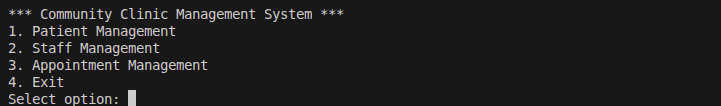
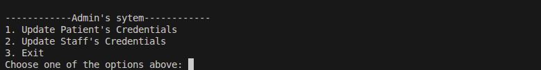
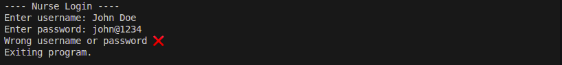
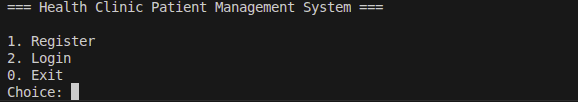

# clinic-patient-management-system
This is a python-based CLI application that demonstrates how small health clinics manage patient records,appointments, and medical history using Object Oriented Programming(OOP).  It consists of the following objects:
- **Receptionist** registers staff and patients and manages appointments
- **Admin** updates the credentials of staff members and patients
- **Nurse** views patient information, updates patient records, records vitals such as blood pressure and weight while checking the appointments
- **Doctor** views patient records, order lab tests, view lab results,prescriptions, and update patient status


*Receptionist's Interface*


*Admin's Interface*


*Nurse's Interface*


*Doctor's Interface*

## Prerequisites
Ensure you have installed Python in your machine:

```bash
python --version
```

**Optional**:Create and activate the Python virtual environment:

```bash
python -m venv venv
source venv/bin/activate  # macOS/Linux
venv\Scripts\activate   # Windows
```

Fork [this repository](https://github.com/joshua-odero/clinic-patient-management-system.git) , then clone it to your preferred folder with the following command:

```bash
git clone <your SSH/Http path>
```

## Installing dependencies
Switch to the app directory using the **cd** command, Use the **pip** to install the project dependencies from PyPi

```bash
cd clinic-patient-management-system
```

```bash
pip install <package_name>
```

## Running the project
In the project's root directory, execute the following command to run a .py script within the directory. Use **python** or **python3** commands depending on your OS:

```bash
python3 <example_file.py>
```
OR

```bash
python <example_file.py>
```
## Task assignment instructions
This OOP project has collaborators who handle different modules:

- **Receptionist Module** by Ronaldo Nyakwama
- **Admin Module** by Joshua Odero
- **Nurse Module** by Angela Musamali
- **Doctor Module** by Samantha Bora